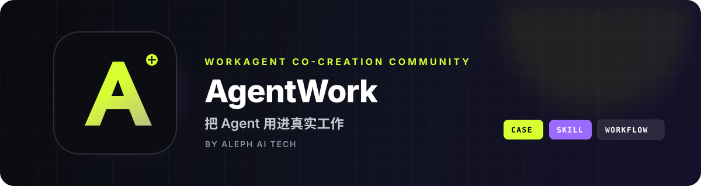

  

  <strong>把 Agent 用进真实工作。</strong> 
  面向真实工作的 WorkAgent 实战共创社区

  <a href="#-社区共识">社区共识</a> ·
  <a href="#-共创成果">共创成果</a> ·
  <a href="#-参与共创">参与共创</a> ·
  <a href="https://github.com/orgs/AlephAITech/discussions">社区讨论</a>

## 👋 欢迎来到 AgentWork

AgentWork 是一个**面向真实工作的 WorkAgent 实战共创社区**。

社区连接 WorkAgent 用户、产品方、行业专家和企业实践者，跨越单一产品，以一项具体的工作任务为起点，共同测试豆包工作、WorkBuddy、千问办公等产品。

我们持续追问四件事：它能不能解决问题，过程能不能复现，结果能不能交付，又会在哪些地方失效。

## 🧭 社区共识

AgentWork 的所有内容都遵循四个标准：

| 真场景 | 真过程 | 真结果 | 真边界 |
| --- | --- | --- | --- |
| 从真实工作任务出发 | 记录可复现的输入与步骤 | 展示可以检查的交付成果 | 说明限制、失败与适用条件 |

一项任务跑通之后，我们会把它沉淀成可以复现的 **Case、Skill 和工作流**，让更多人继续使用、验证和完善。

> **把一人的用法，变成百业的方法。**

## 🚀 共创成果

| 项目 | 内容 | 快速入口 | 社区热度 |
| --- | --- | --- | --- |
| **[WorkBuddyGuide](https://github.com/AlephAITech/WorkBuddyGuide)** | WorkBuddy 实战蓝皮书：从第一项任务到多 Agent 团队，覆盖教程、真实工作流、Skills、自动化与社区案例 | [在线阅读](https://workbuddy.homes/) · [案例集](https://workbuddy.homes/cases/) · [参与共创](https://github.com/AlephAITech/WorkBuddyGuide/blob/main/CONTRIBUTING.md) |   |
| **[DoubaoWorkGuide](https://github.com/AlephAITech/DoubaoWorkGuide)** | 豆包工作系统化中文实践指南：49 篇指南与 31 个真实任务，覆盖连接器、Skill、API、定时任务与多 Agent 工作流 | [在线阅读](https://doubaowork.homes/) · [查看源码](https://github.com/AlephAITech/DoubaoWorkGuide) |   |
| **[moyuxl-ecom-image-prompt](https://github.com/AlephAITech/moyuxl-ecom-image-prompt)** | 面向电商主图与详情页的视觉策划 Skill，支持参考反推、卖点研究、设计大纲、逐屏提示词与生产验收 | [使用说明](https://github.com/AlephAITech/moyuxl-ecom-image-prompt#readme) · [安装 Skill](https://github.com/AlephAITech/moyuxl-ecom-image-prompt#在豆包中使用) |  |

## 🧩 从哪里开始

- 想系统掌握 WorkBuddy：从 [WorkBuddy 实战蓝皮书](https://workbuddy.homes/) 的第一章开始。
- 正在使用豆包工作：打开 [豆包工作指南](https://doubaowork.homes/)，按真实任务选择相近案例。
- 要制作电商主图或详情页：查看 [电商视觉 Skill](https://github.com/AlephAITech/moyuxl-ecom-image-prompt)，先准备产品资料与可公开使用的素材。
- 还在探索一个真实工作问题：前往 [社区讨论](https://github.com/orgs/AlephAITech/discussions)，分享场景、现有方法与期待结果。
- 已经沉淀出可复用的方法：在对应仓库提交 Issue 或 Pull Request，与社区一起完善。

## 🤝 参与共创

欢迎补充真实案例、修正文案、完善 Skill、改进阅读体验。一次高质量贡献通常包含：

1. 清晰的任务背景与目标；
2. 已移除隐私和业务敏感信息的输入材料；
3. 可复现的执行步骤与必要配置；
4. 交付结果、截图或其他验证证据；
5. 明确的验收标准与适用边界。

第一次参与开源协作，可以先从修正错别字、补充链接或完善一个小案例开始。具体要求请阅读各项目的 README 与贡献指南。

需要寻找共创伙伴、交流测试结果或讨论失效边界，可以直接进入 [AgentWork Discussions](https://github.com/orgs/AlephAITech/discussions)。

  <strong>把 Agent 用进真实工作。</strong> 
  AgentWork Community · Powered by Aleph AI Tech

